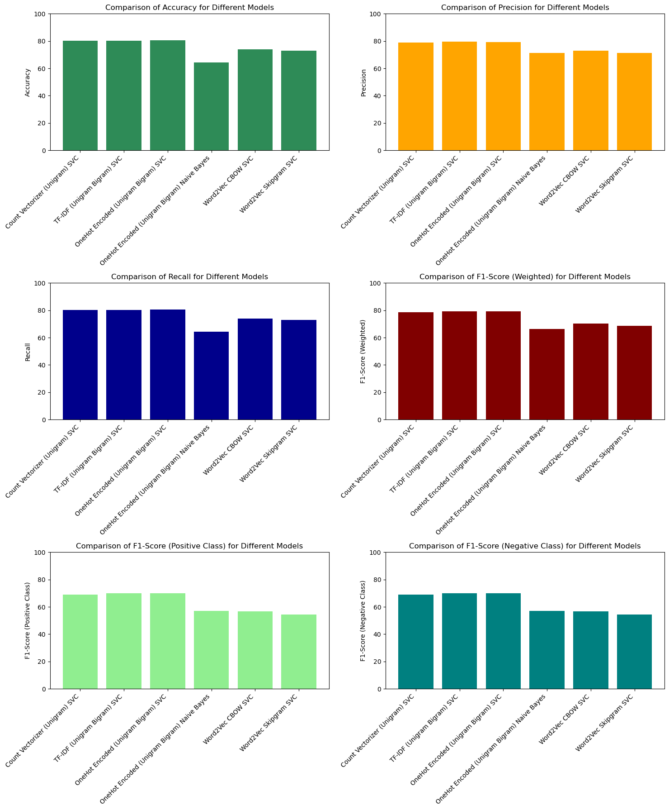

# Sentiment-Analysis-and-Text-Classification-with-NLP
This project aims to perform sentiment analysis on textual data using a variety of natural language processing (NLP) techniques combined with machine learning classifiers. The focus is on comparing the performance of different vectorization methods and models, identifying the most effective approach for sentiment prediction.

## Project Structure
- `Sentiment_Data.csv`: The dataset containing text data for sentiment analysis.
- `abbreviation_dict.json`: Dictionary used for expanding abbreviations in the text.
- `emoticons.json`: File for converting emoticons into meaningful text.
- `Modelling.ipynb`: Main notebook for building and evaluating machine learning models.
- `Model_Summary.csv`: Summary of performance metrics (accuracy, precision, recall, F1-score) for each model.
- `.pkl` Files: Saved machine learning models for future use:
  - `Model_CountVec_Unigram.pkl`
  - `Model_OneHot_UnigramBigram_NB.pkl`
  - `Model_OneHot_UnigramBigram_SVC.pkl`
  - `Model_TFIDF_UnigramBigram.pkl`
  - `Model_Word2Vec_CBOW.pkl`
  - `Model_Word2Vec_SKIPGRAM.pkl`

## Models and Techniques Used
1. **Preprocessing**:
    -  Missing Value Analysis
    -  Removal of HTML tags, urls, twitter handles
    -  Handled hastags
    -  Handled slang and abbreviations
    -  Replaced emoticons with text
    -  Tokenization
    -  Stopword removal
    -  Lemmatization
    
2. **Feature Extraction**:
   - Count Vectorizer (Unigram)
   - TF-IDF (Unigram, Bigram)
   - OneHot Encoding (Unigram, Bigram)
   - Word2Vec (CBOW, Skipgram)

3. **Classification Models**:
   - Support Vector Classifier (SVC)
   - Naive Bayes Classifier

## Key Results
Each model was evaluated on accuracy, precision, recall, and F1-score, with results summarized in `Model_Summary.csv`. The OneHot Encoding combined with SVC achieved the best balance between precision and recall.

## Performance Comparison
The following plot summarizes the performance metrics of different models used in this project:



## Summary of the Project
In this project, I performed sentiment analysis on a given dataset using multiple natural language processing (NLP) techniques and machine learning models to classify text into positive, negative, or neutral categories. The data was preprocessed with the help of dictionaries for abbreviation expansion and emoticon handling to enhance accuracy. 

The models used for the classification include Support Vector Classifier (SVC) and Naive Bayes with different feature extraction techniques such as Count Vectorizer, TF-IDF, OneHot Encoding, and Word2Vec. The effectiveness of each model was evaluated using metrics like accuracy, precision, recall, and F1-score, and the results were summarized for easy comparison. The OneHot Encoded SVC model with unigram and bigram features showed the best performance overall. The comparison of all six models is visualized in the performance comparison plot included above.

## Usage
To explore the project, you can run the notebooks:
- Start with `code.ipynb` to see data preprocessing steps.
- Proceed with `Modelling.ipynb` to train the models and evaluate their performance.

## Requirements
- Python 3.x
- Jupyter Notebook
- Required libraries: `pandas`, `scikit-learn`, `numpy`, `gensim`, `matplotlib`, etc.

You can install the dependencies by running:
```sh
pip install -r requirements.txt


